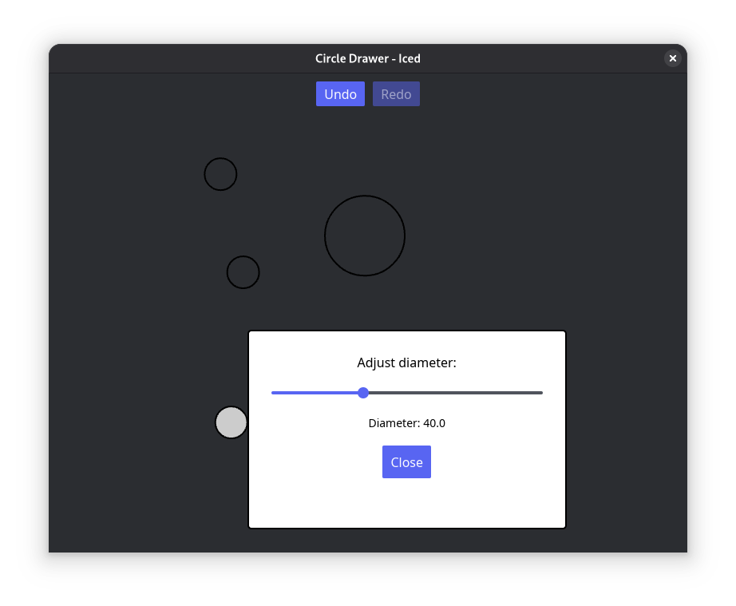

# Circle Drawer - 7GUIs Benchmark

Rust with Iced

## Overview
An Iced GUI app to create and manipulate circles on a canvas, implementing undo/redo functionality and dialog-based diameter adjustment.

## Requirements

### UI Components
- Frame containing:
  - Undo button
  - Redo button
  - Canvas area

### Circle Creation
- Left-click on empty canvas area creates an unfilled circle
- Circle center is at the clicked point
- Circle has a fixed initial diameter

### Circle Selection
- Circle nearest to mouse pointer is selected if pointer is within its radius
- Selected circle is filled gray
- Only one circle can be selected at a time

### Diameter Adjustment
- Right-click on selected circle shows popup menu
- Menu contains single entry: "Adjust diameter..."
- Clicking menu entry opens dialog frame with slider control
- Slider adjusts diameter of selected circle
- Diameter changes apply immediately while slider is moved
- Closing dialog marks the diameter change as significant for undo/redo history

### Undo/Redo Functionality
- **Undo**: Reverts last significant change
  - Significant changes: circle creation or diameter adjustment (after dialog close)
- **Redo**: Reapplies last undone change
  - Redo is only available if no new changes have been made since the undo

## Challenges
- **Undo/redo**: Implement history management for reversible operations
- **Custom drawing**: Render circles on canvas with selection state
- **Dialog control**: Maintain context across GUI interaction steps (canvas → popup → dialog → canvas)

## About 7GUIs: A GUI Programming Benchmark

There are countless GUI toolkits in different languages and with diverse approaches to GUI development. Yet, diligent comparisons between them are rare. Whereas in a traditional benchmark competing implementations are compared in terms of their resource consumption, here implementations are compared in terms of their notation. To that end, [7GUIs](https://eugenkiss.github.io/7guis/) defines seven tasks that represent typical challenges in GUI programming. In addition, 7GUIs provides a recommended set of evaluation dimensions.
