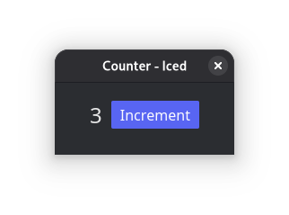

# Counter - 7GUIs Benchmark

## Overview
An Iced GUI app demonstrating simple state management

## Requirements

Build a frame containing:
- A label or read-only textfield (T) displaying a numeric value
- A button (B) for incrementing the counter

### Behavior
- Initial value in T is "0"
- Each click of B increases the value in T by one

### Goals
- Demonstrate basic Iced scaffolding
- Demonstrate simple state management
- Show how fundamental Iced features work together
- Minimal complexity and scaffolding
