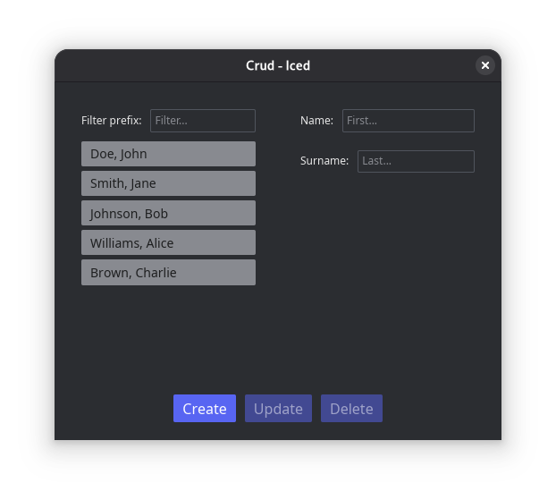

# CRUD - 7GUIs Benchmark

## Overview
A Iced GUI app demonstrating Create, Read, Update, and Delete operations on a list of names.

## Core Challenges
- Separating domain and presentation logic
- Managing mutation efficiently
- Building a non-trivial layout

## UI Elements
- **Tprefix**: Filter textfield for surname prefix
- **Tname**: Name input textfield
- **Tsurname**: Surname input textfield
- **L**: Listbox displaying filtered names from database
- **BC**: Create button - appends new name to list
- **BU**: Update button - replaces selected entry with new name
- **BD**: Delete button - removes selected entry
- **Labels**: Descriptive labels for input fields

## Functional Requirements

### Filtering
- Entering text in Tprefix immediately filters names whose surnames start with the prefix
- No submit action required - filtering is real-time

### Selection
- At most one entry can be selected in L at a time
- BU and BD are enabled only when an entry is selected

### Operations
- **Create (BC)**: Concatenates Tname + Tsurname and appends to L
- **Update (BU)**: Replaces selected entry with concatenated name from Tname + Tsurname
- **Delete (BD)**: Removes selected entry from L

## Layout Requirements
- Listbox L must occupy all remaining available space
- Layout should follow standard form-over-data pattern

## Implementation Goals
- Clean separation between domain and presentation logic (e.g., MVC pattern)
- Minimal framework-specific overhead
- Fast and reliable mutation management
- Natural layout representation
