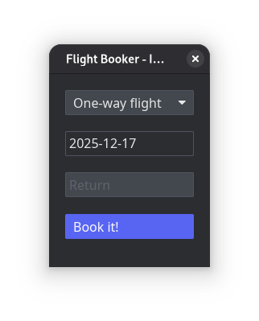

# Flight Booker - 7GUIs Benchmark

Rust with Iced

## Overview
An Iced GUI app presenting a flight booking interface that demonstrates constraint modeling between and within widgets.

## Components
- **Combobox (C)**: Options "one-way flight" and "return flight"
- **Text field (T1)**: Start date
- **Text field (T2)**: Return date
- **Button (B)**: Submit booking

## Constraints

### Widget Dependencies
- T2 is enabled only when C = "return flight"
- B is disabled when:
  - Any enabled text field contains an ill-formatted date
  - C = "return flight" AND T2's date is before T1's date

### Widget States
- Ill-formatted date fields are colored red and disable B
- Initial state:
  - C = "one-way flight"
  - T1 and T2 = same arbitrary date
  - T2 disabled

## Behavior
When B is clicked, display a message confirming the selection:
- Example: "You have booked a one-way flight on 04.04.2014."

## Focus
Demonstrate clear, succinct, and explicit constraint modeling in the source code without excessive scaffolding.

## About 7GUIs: A GUI Programming Benchmark

There are countless GUI toolkits in different languages and with diverse approaches to GUI development. Yet, diligent comparisons between them are rare. Whereas in a traditional benchmark competing implementations are compared in terms of their resource consumption, here implementations are compared in terms of their notation. To that end, [7GUIs](https://eugenkiss.github.io/7guis/) defines seven tasks that represent typical challenges in GUI programming. In addition, 7GUIs provides a recommended set of evaluation dimensions.
