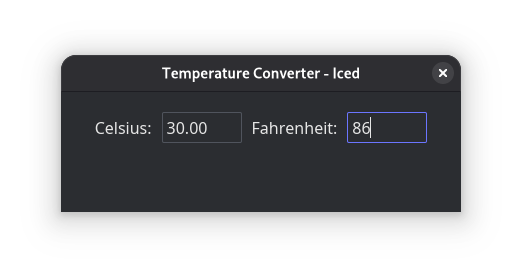

# Temperature Converter - 7GUIs Benchmark

Rust with Iced

## Overview
A Iced GUI app presenting a temperature conversion interface that demonstrates bidirectional data flow between Celsius and Fahrenheit text fields.

## Requirements

### UI Components
- Two text input fields labeled TC (Celsius) and TF (Fahrenheit)
- Both fields initially empty

### Behavior
- When user enters a numerical value in TC, TF updates automatically
- When user enters a numerical value in TF, TC updates automatically
- Non-numerical input in either field does not trigger updates
- Conversion happens in real-time as user types

### Conversion Formulas
- Celsius to Fahrenheit: `F = C * (9/5) + 32`
- Fahrenheit to Celsius: `C = (F - 32) * (5/9)`

## Challenges
- **Bidirectional data flow**: Changes in either field must update the other
- **User-provided text input**: Must validate numerical input and handle invalid entries gracefully

## Success Criteria
A good solution will:
- Make the bidirectional dependency clear and explicit
- Minimize boilerplate code
- Handle input validation elegantly

## About 7GUIs: A GUI Programming Benchmark

There are countless GUI toolkits in different languages and with diverse approaches to GUI development. Yet, diligent comparisons between them are rare. Whereas in a traditional benchmark competing implementations are compared in terms of their resource consumption, here implementations are compared in terms of their notation. To that end, [7GUIs](https://eugenkiss.github.io/7guis/) defines seven tasks that represent typical challenges in GUI programming. In addition, 7GUIs provides a recommended set of evaluation dimensions.
