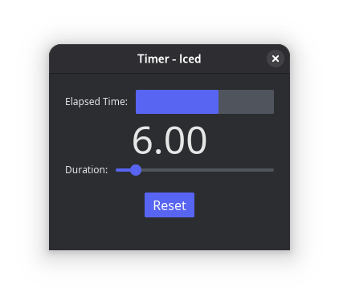

# Timer- 7GUIs Benchmark

A Iced GUI app that demonstrates concurrency, competing user/signal interactions, and UI responsiveness.

## Requirements

### UI Components

- **Gauge (G)**: Visual indicator showing elapsed time `e`
- **Label**: Numerical display of elapsed time
- **Slider (S)**: Adjusts timer duration `d` (0 to max duration)
- **Reset Button (R)**: Resets elapsed time to zero

### Behavior

- Timer increments elapsed time `e` until `e ≥ d`
- Slider adjustments to duration `d` reflect immediately (not just on release)
- Gauge fill updates immediately when slider moves
- Timer stops when `e ≥ d` (gauge full)
- Timer restarts if duration increased such that `d > e`
- Reset button sets `e = 0`

### Challenges

- **Concurrency**: Timer process updates elapsed time concurrently with user interactions
- **Competing Interactions**: Handling simultaneous user input and timer tick signals
- **Responsiveness**: Slider adjustments must be reflected immediately in UI

## Implementation

Built with Rust and the Iced GUI framework. Timer ticks occur every 50ms via subscription.

## About 7GUIs: A GUI Programming Benchmark

There are countless GUI toolkits in different languages and with diverse approaches to GUI development. Yet, diligent comparisons between them are rare. Whereas in a traditional benchmark competing implementations are compared in terms of their resource consumption, here implementations are compared in terms of their notation. To that end, [7GUIs](https://eugenkiss.github.io/7guis/) defines seven tasks that represent typical challenges in GUI programming. In addition, 7GUIs provides a recommended set of evaluation dimensions.
